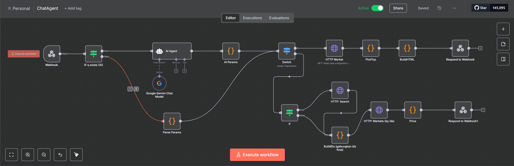
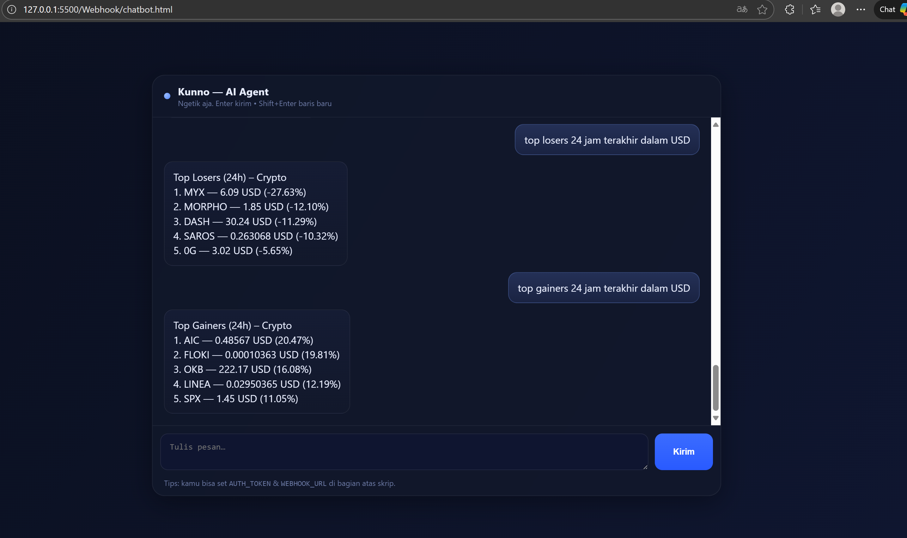

# 🤖 ChatAgent – Crypto Chatbot dengan n8n + Coingecko API

[](https://n8n.io)   [](#-lisensi)

ChatAgent adalah **chatbot interaktif berbasis n8n** yang dapat memberikan informasi harga cryptocurrency secara real-time, termasuk **top gainers/losers** dan **harga koin tertentu** dalam berbagai mata uang (USD / IDR).  
Proyek ini dibuat untuk eksperimen **AI Agent + Data Pipeline** menggunakan **n8n**, **Coingecko API**, dan sedikit **custom JavaScript nodes**.

<p align="center">
  
</p>

---

## ✨ Fitur Utama
- 🔹 **Top Gainers / Losers**  
  Menampilkan koin dengan performa terbaik atau terburuk dalam periode 1 jam atau 24 jam.  
  Contoh:  
  - `top gainers 1 jam di rupiah`  
  - `top losers 24 jam di usd`

- 🔹 **Harga Coin Tertentu**  
  Mendapatkan harga terbaru untuk 1 atau beberapa coin.  
  Contoh:  
  - `harga BTC di rupiah`  
  - `harga btc, eth, sol di usd`

- 🔹 **Ringkasan Tabel HTML**  
  Selain teks singkat, ChatAgent juga mengembalikan versi **HTML table** sehingga hasil dapat ditampilkan dalam format rapi (misalnya untuk front-end chatbot web).

- 🔹 **Dukungan Bahasa Natural**  
  Bisa menerima pertanyaan dalam bahasa Indonesia atau campuran Inggris.  
  Contoh:  
  - `coin apa yang paling naik 1 jam terakhir?`  
  - `show top losers 24h in rupiah`

---

## 🏗️ Arsitektur Workflow (n8n)

1. **Webhook**  
   Menerima input dari chatbot HTML (pertanyaan user).

2. **AI Agent (Gemini / LLM)**  
   Mengubah pertanyaan natural language menjadi JSON parameter (misalnya `{"mode":"top","type":"losers","window":"1h","vs":"idr","top":5}`).

3. **AI Params (Code Node)**  
   - Membersihkan output AI Agent (menghilangkan backticks/label `json`)  
   - Melakukan fallback regex kalau field kosong (misalnya detect `losers`, `rupiah`, `1 jam` dari teks).

4. **Switch**  
   Menentukan mode:
   - `top` → ambil data pasar semua koin → sortir top gainers/losers → buat tabel.  
   - `price` → ambil harga coin tertentu berdasarkan ID.

5. **HTTP Market / HTTP Search / HTTP Markets (by ids)**  
   Query ke **Coingecko API** untuk mendapatkan data pasar crypto.

6. **PickTop (Code Node)**  
   - Menggabungkan semua item hasil API  
   - Menyortir sesuai `type` (gainers/losers) dan `window` (1h/24h)  
   - Mengambil N koin teratas

7. **BuildHTML (Code Node)**  
   Membuat output teks ringkas (`reply`) + tabel HTML (`html`).

8. **Respond to Webhook**  
   Mengembalikan JSON ke chatbot frontend dengan field:
   ```json
   {
     "reply": "Top Losers (1h) – IDR\n1. BTC ...",
     "html": "<!doctype html>..."
   }
   ```

---

## ⚡ Teknologi yang Digunakan
- [n8n](https://n8n.io/) – Workflow automation
- [Coingecko API](https://www.coingecko.com/en/api) – Data harga crypto
- [Gemini / LLM](https://ai.google.dev/gemini-api) – Natural language → structured params
- Custom **JavaScript Function Nodes** untuk parsing dan membangun HTML

---

## 📌 Contoh Pertanyaan
- `top gainers 1 jam di rupiah`
- `top losers 24 jam di usd`
- `harga BTC di rupiah`
- `harga btc, eth, sol di usd`
- `coin apa yang paling naik 1 jam terakhir?`
- `mana token paling rugi sehari ini?`

---

## 📷 Demo (Screenshot)
<p align="center">
  
</p>

---

## 💡 Catatan Pengembangan
- **CORS** perlu diatur di node Respond to Webhook (gunakan `Access-Control-Allow-Origin: *` saat testing).  
- Output AI Agent kadang tidak JSON valid → ditangani dengan parsing + regex fallback di **AI Params**.  
- Workflow ini bisa diperluas:
  - Tambah sorting by `market_cap` atau `volume`
  - Integrasi Telegram/Discord bot
  - Menambahkan cache supaya tidak overload API Coingecko

---

## 📜 Lisensi
Proyek ini dibuat untuk keperluan pembelajaran & eksperimen.  
Gunakan dengan bijak – data harga diambil dari API publik Coingecko.
